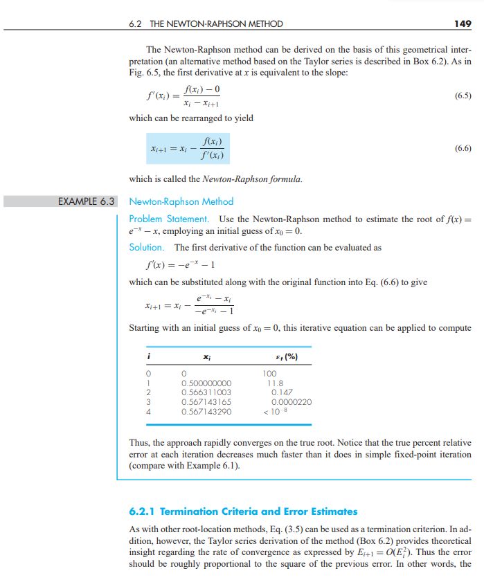
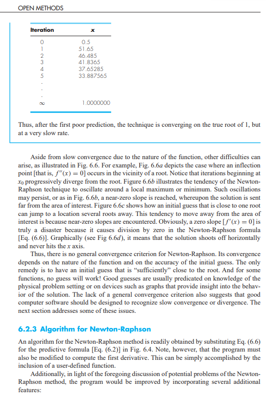

# Kelompok 8 - Metode Newton-Raphson

## 📜 Deskripsi Program

Program ini adalah implementasi dalam bahasa C dari **Metode Newton-Raphson**, sebuah algoritma numerik yang digunakan untuk menemukan akar-akar (atau nol-nol) dari suatu fungsi bernilai riil. Metode ini bekerja secara iteratif dengan menggunakan garis singgung kurva fungsi pada tebakan awal untuk mendapatkan tebakan berikutnya yang lebih dekat ke akar.

Formula iteratif yang digunakan adalah:
$x_{i+1} = x_i - \frac{f(x_i)}{f'(x_i)}$

Program ini memungkinkan pengguna untuk:
1.  Memasukkan tebakan awal ($x_0$) untuk akar.
2.  Memasukkan toleransi error yang diinginkan untuk kriteria berhenti.
3.  Memasukkan jumlah maksimum iterasi untuk mencegah loop tak terbatas.
4.  Menghitung perkiraan akar dari fungsi yang telah ditentukan (defaultnya $f(x) = x^2 - 4$, namun dapat dengan mudah dimodifikasi di dalam kode sumber pada fungsi `fungsi` dan `turunan_fungsi`).
5.  Menampilkan hasil akar perkiraan dan jumlah iterasi yang dilakukan.
6.  Menampilkan detail setiap iterasi, termasuk nilai $x_i$, $f(x_i)$, $f'(x_i)$, $x_{i+1}$, dan error relatif perkiraan.
7.  Memberikan peringatan jika turunan fungsi mendekati nol (yang dapat menyebabkan masalah konvergensi) atau jika jumlah maksimum iterasi tercapai.

Program ini juga menyertakan perbandingan dengan akar analitik (jika diketahui dan relevan untuk fungsi yang diuji) untuk memvalidasi hasil.

---

## 🧑‍💻 Anggota Kelompok

* 2306225981 - Jonathan Frederick Kosasih
* 2306161845 - Nelson Laurensius
* 2306209095 - Benedict Aurelius
* 2306161952 - Christian Hadiwijaya

---

## 🖼️ Gambar Referensi Materi

Untuk pemahaman konsep integrasi numerik yang lebih mendalam, beberapa gambar referensi dari buku "MATLAB Programming for Engineers" oleh Stephen J. Chapman (6th Edition) disertakan dalam folder `Materi` di *root* direktori proyek ini. 

 
 
 
 
 


---


### Kompilasi 
Buka terminal atau command prompt, navigasikan ke direktori tempat file `.c` disimpan yaitu folder `Pemrograman`, dan jalankan perintah berikut:
```bash
gcc NewtonRaphson.c -o NewtonRaphson 
```

### Menjalankan Program
Setelah kompilasi berhasil, jalankan program dari terminal:
```bash
./NewtonRaphson
```
Program akan meminta Anda untuk memasukkan tebakan awal, toleransi, dan jumlah maksimum iterasi.

---

## 🔧 MModifikasi Fungsi dan Turunannya
Untuk mencari akar dari fungsi yang berbeda, Anda perlu memodifikasi dua fungsi di dalam kode sumber:

1. fungsi(double x): Merepresentasikan $f(x)$.
2. turunan_fungsi(double x): Merepresentasikan $f'(x)$, turunan pertama dari fungsi(x).

PENTING: turunan_fungsi harus merupakan turunan analitik yang benar dari fungsi agar Metode Newton-Raphson bekerja dengan benar.


Contoh (default):
```bash
double fungsi(double x) {
    return x * x - 4.0; // f(x) = x^2 - 4
}

double turunan_fungsi(double x) {
    return 2.0 * x; // f'(x) = 2x
}
```
Untuk mengganti dengan, misalnya, $f(x) = e^{-x} - x$ 
```bash
#include <math.h> // Pastikan ini ada di bagian atas file

double fungsi(double x) {
    return exp(-x) - x; // f(x) = e^(-x) - x
}

double turunan_fungsi(double x) {
    return -exp(-x) - 1.0; // f'(x) = -e^(-x) - 1
}
```
